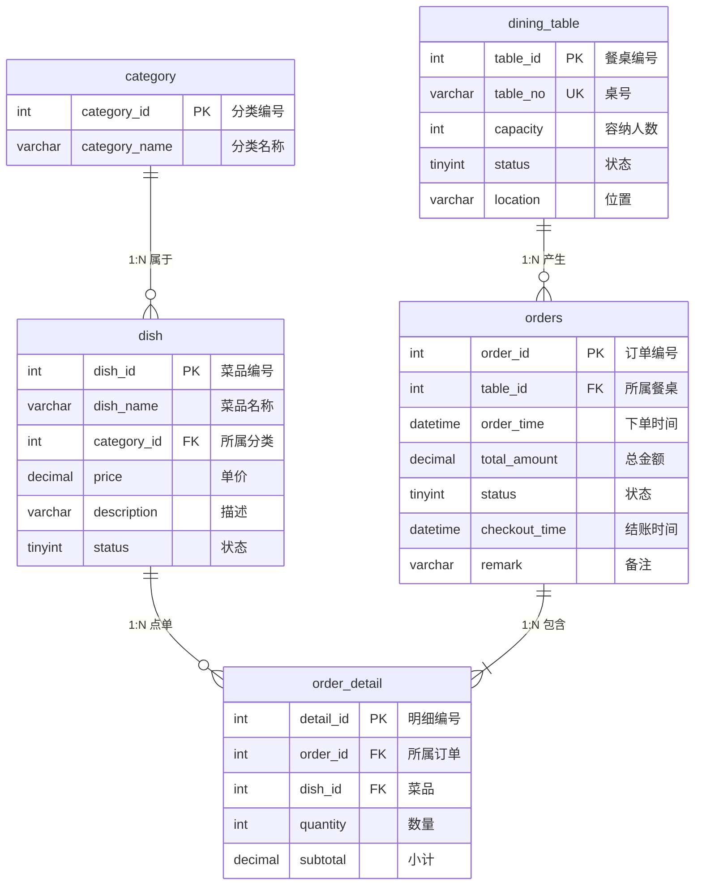

# 餐厅点餐管理系统 —— 需求分析

---

## 一、系统功能描述

本系统面向中小型餐厅，实现餐桌管理、菜品管理、点餐下单、订单结算及统计查询等功能。

### 1. 菜品管理
- 菜品分类管理（凉菜、热菜、主食、汤类、饮品等）
- 菜品信息的增删改查（名称、价格、描述等）
- 菜品状态管理（在售 / 下架）

### 2. 餐桌管理
- 餐桌信息维护（桌号、容纳人数、位置）
- 餐桌状态管理（空闲 / 占用）

### 3. 点餐功能
- 选择空闲餐桌开台，创建订单
- 浏览菜单，选择菜品并指定数量
- 支持加菜、退菜（修改订单明细）

### 4. 订单管理
- 订单状态流转（点餐中 → 已下单 → 已结账 / 已取消）
- 支持取消未下单订单

### 5. 结账功能
- 计算订单总金额
- 完成结账，释放餐桌为空闲

### 6. 查询统计
- 按日期、餐桌查询历史订单
- 菜品销量排行统计
- 每日/每月营业额统计

---

## 二、数据字典

### 实体1：菜品分类（category）

| 属性名 | 数据类型 | 约束 | 说明 |
|--------|----------|------|------|
| category_id | INT | PRIMARY KEY, AUTO_INCREMENT | 分类编号 |
| category_name | VARCHAR(50) | NOT NULL, UNIQUE | 分类名称 |

### 实体2：菜品（dish）

| 属性名 | 数据类型 | 约束 | 说明 |
|--------|----------|------|------|
| dish_id | INT | PRIMARY KEY, AUTO_INCREMENT | 菜品编号 |
| dish_name | VARCHAR(100) | NOT NULL | 菜品名称 |
| category_id | INT | NOT NULL, FOREIGN KEY → category(category_id) | 所属分类 |
| price | DECIMAL(10,2) | NOT NULL, CHECK(price > 0) | 单价（元） |
| description | VARCHAR(500) | | 菜品描述 |
| status | TINYINT | NOT NULL, DEFAULT 1, CHECK(status IN (0,1)) | 1-在售，0-下架 |

### 实体3：餐桌（dining_table）

| 属性名 | 数据类型 | 约束 | 说明 |
|--------|----------|------|------|
| table_id | INT | PRIMARY KEY, AUTO_INCREMENT | 餐桌编号 |
| table_no | VARCHAR(10) | NOT NULL, UNIQUE | 桌号（如 A01、B12） |
| capacity | INT | NOT NULL, CHECK(capacity > 0) | 容纳人数 |
| status | TINYINT | NOT NULL, DEFAULT 0, CHECK(status IN (0,1)) | 0-空闲，1-占用 |
| location | VARCHAR(50) | | 位置描述（如"大厅""包间"） |

### 实体4：订单（orders）

| 属性名 | 数据类型 | 约束 | 说明 |
|--------|----------|------|------|
| order_id | INT | PRIMARY KEY, AUTO_INCREMENT | 订单编号 |
| table_id | INT | NOT NULL, FOREIGN KEY → dining_table(table_id) | 所属餐桌 |
| order_time | DATETIME | NOT NULL, DEFAULT CURRENT_TIMESTAMP | 下单时间 |
| total_amount | DECIMAL(10,2) | DEFAULT 0 | 订单总金额 |
| status | TINYINT | NOT NULL, DEFAULT 0, CHECK(status IN (0,1,2,3)) | 0-点餐中，1-已下单，2-已结账，3-已取消 |
| checkout_time | DATETIME | | 结账时间 |
| remark | VARCHAR(200) | | 备注 |

### 实体5：订单详情（order_detail）

| 属性名 | 数据类型 | 约束 | 说明 |
|--------|----------|------|------|
| detail_id | INT | PRIMARY KEY, AUTO_INCREMENT | 明细编号 |
| order_id | INT | NOT NULL, FOREIGN KEY → orders(order_id) | 所属订单 |
| dish_id | INT | NOT NULL, FOREIGN KEY → dish(dish_id) | 菜品 |
| quantity | INT | NOT NULL, CHECK(quantity > 0) | 数量 |
| subtotal | DECIMAL(10,2) | NOT NULL | 小计金额 |

---

## 三、E-R 图



**实体关系说明：**

| 关系 | 类型 | 说明 |
|------|------|------|
| category ↔ dish | 1 : N | 一个分类下可有多个菜品 |
| dish ↔ order_detail | 1 : N | 一个菜品可被多次点单 |
| dining_table ↔ orders | 1 : N | 一张餐桌可产生多个历史订单 |
| orders ↔ order_detail | 1 : N | 一个订单包含多条明细 |

---

## 四、关系模式

### 1. 菜品分类表 category
```
category(category_id, category_name)
主键：category_id
```

### 2. 菜品表 dish
```
dish(dish_id, dish_name, category_id, price, description, status)
主键：dish_id
外键：category_id → category(category_id)
```

### 3. 餐桌表 dining_table
```
dining_table(table_id, table_no, capacity, status, location)
主键：table_id
唯一约束：table_no
```

### 4. 订单表 orders
```
orders(order_id, table_id, order_time, total_amount, status, checkout_time, remark)
主键：order_id
外键：table_id → dining_table(table_id)
```

### 5. 订单详情表 order_detail
```
order_detail(detail_id, order_id, dish_id, quantity, subtotal)
主键：detail_id
外键：order_id → orders(order_id)
外键：dish_id → dish(dish_id)
```

---

## 五、约束设计说明

| 约束类型 | 表 | 字段 | 设计目的 |
|----------|-----|------|----------|
| PRIMARY KEY | 所有表 | 各主键字段 | 唯一标识每条记录 |
| FOREIGN KEY | dish | category_id | 保证菜品必须属于已存在的分类，防止数据孤岛 |
| FOREIGN KEY | orders | table_id | 保证订单必须关联到已存在的餐桌 |
| FOREIGN KEY | order_detail | order_id | 保证明细必须属于已存在的订单 |
| FOREIGN KEY | order_detail | dish_id | 保证明细中引用的菜品必须存在 |
| NOT NULL | dish | dish_name, price | 菜品名称和价格是核心信息，不能为空 |
| NOT NULL | dining_table | table_no, capacity | 桌号和容纳人数是餐桌必填信息 |
| NOT NULL | order_detail | quantity, subtotal | 数量和金额为必填项 |
| UNIQUE | dining_table | table_no | 桌号必须唯一，避免混淆 |
| UNIQUE | category | category_name | 分类名称不能重复 |
| CHECK | dish | price > 0 | 菜品价格必须为正数 |
| CHECK | dining_table | capacity > 0 | 容纳人数必须为正数 |
| CHECK | order_detail | quantity > 0 | 点餐数量必须为正数 |
| CHECK | dish | status IN (0,1) | 状态值限定为 0 或 1 |
| CHECK | dining_table | status IN (0,1) | 状态值限定为 0 或 1 |
| CHECK | orders | status IN (0,1,2,3) | 订单状态值限定在合法范围内 |
